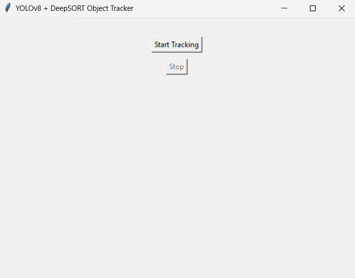
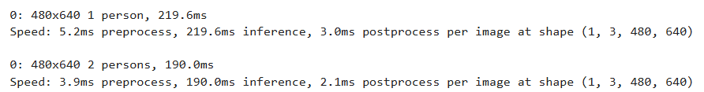

# Real-Time Object Detection and Tracking with YOLOv8 + DeepSORT (Tkinter GUI)

This Python script creates a real-time object detection and tracking application using YOLOv8 and DeepSORT within a Tkinter-based GUI. It captures video from the webcam using OpenCV, performs object detection with a YOLOv8 model (`yolov8n.pt`), and tracks detected objects across frames using DeepSORT, assigning each a unique ID. The GUI allows users to start and stop the tracking process with buttons, and displays the live video feed with bounding boxes and IDs overlaid. Pillow is used to convert OpenCV frames for display in Tkinter, creating an interactive desktop application for visual object tracking.
 

---

## Description

This project implements a real-time object detection and tracking system using:

- **YOLOv8** for accurate and fast object detection  
- **DeepSORT** for multi-object tracking with consistent IDs  
- **Tkinter GUI** for easy interaction with Start and Stop controls  

The system captures live video from your webcam, detects objects in each frame, tracks them across frames, and displays the video with bounding boxes and unique IDs in a GUI window.

---

## Features

- Real-time object detection and tracking using state-of-the-art models  
- Lightweight YOLOv8n model for fast inference  
- DeepSORT tracker to maintain object identities over time  
- Simple and clean GUI using Tkinter  
- Start and stop webcam feed with buttons  

---

## screenshots

 

 

---

## Usage
1.Run the GUI application:
    ```bash
    python object_tracking_gui.py

-Click Start Tracking to begin detection and tracking via webcam.
-Click Stop to stop the webcam feed.
-Close the window to exit the app.

---

## troubleshooting:

-Ensure your webcam is free and accessible.
-Use smaller YOLO models (yolov8n.pt) for better performance on low-end hardware.
-Verify all dependencies are installed properly.

---

## Installation

1. Clone the repository:
   ```bash
   git clone https://github.com/yourusername/your-repo-name.git
   cd your-repo-name
